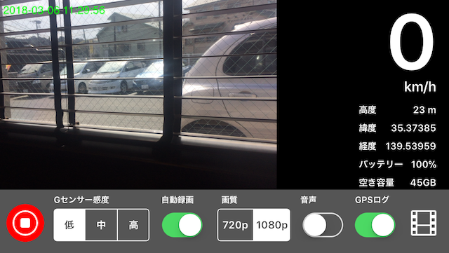

# ドラカメ

### 概要

バイクでうっかり速度違反してしまうのをなるべく減らしたいので、危険速度を認識しやすくするための機器です。
大きめの文字で速度を表示し速度に応じて画面の色が変ります。
ついでにドライブレコーダーの機能も付けました。
ドライブレコーダーは加速度センサーから取得した衝撃を感知して録画を開始する、あるいは走り出したら録画を開始する機能を持ちます。

使わなくなったiPhone 5sで使えれば良いと思い、画面の大きさの違う端末への対応はしていません。

### 主な機能（平成３０年３月６日の時点）

+ GPSを利用した走行速度の表示（スピードメーターの背景は50km/hで青、70km/hで紫、100km/hで赤、110km/h以上で赤の点滅）
+ 緯度・経度・高度・バッテリー残量・ストレージ空き容量の表示
+ Bluetoothマイコンへの速度送信
+ Bluetoothマイコンとの接続状態の表示
+ ビデオの品質は1280x720または1920x1080
+ 走行を始めると自動的に録画を開始する（時速10km/hが閾値）
+ Gを検知すると自動的に録画を開始する（Gセンサーの感度の調整は車載方法によっては調整が必要）
+ 音声録音のON/OFF
+ GPSロギングのON/OFF
+ 記録されたビデオの再生
+ 記録されたGPSログの地図への表示
+ AirDropなどを利用したビデオとGPSログの転送

### 開発環境
+ iOS 11.0+
+ Xcode 9.2
+ Swift 4.0
+ iPhone 5s (画面サイズは5s専用です)

### BLE接続するマイコンアプリケーション
Adafruit Bluefruit LE Microを使ったスピードディスプレイ。

 [Speedmeter](https://github.com/kazz12211/blespeedmeter)

### 開発上の課題

+ AVCaptureMovieFileOutputを使用した録画では、ビデオにタイムスタンプや速度をオーバーレイできないので、AVCaptureVideoDataOutputを使用したいところ。
+ 例えば、停車した際に自動で記録を停止する機能が欲しい。
+ GPSログはGoogleMapなどに取り込んで経路表示ができるフォーマットで書き出すのが良い。

### 実用上の課題

+ iPhone+防水型ケースはバイクの車載機器としては重いので走行時の振動の影響が小さくない。その為、防振対策を施さなければ綺麗なビデオを記録することができない。
+ 雨天時に給電しながら使用できるケースはほとんどなく浸水対策が困難。（少しの雨なら問題ない）
+ 駐車時にiPhoneの盗難に遭わないために、毎回取り外すのは面倒臭いし、完全に固定して容易に取り外せないようにすると取り外したい時に面倒臭い。
+ 給電しながら運用した場合の熱対策が難しい。
+ バイクの種類によっては搭載場所が確保しにくい。
